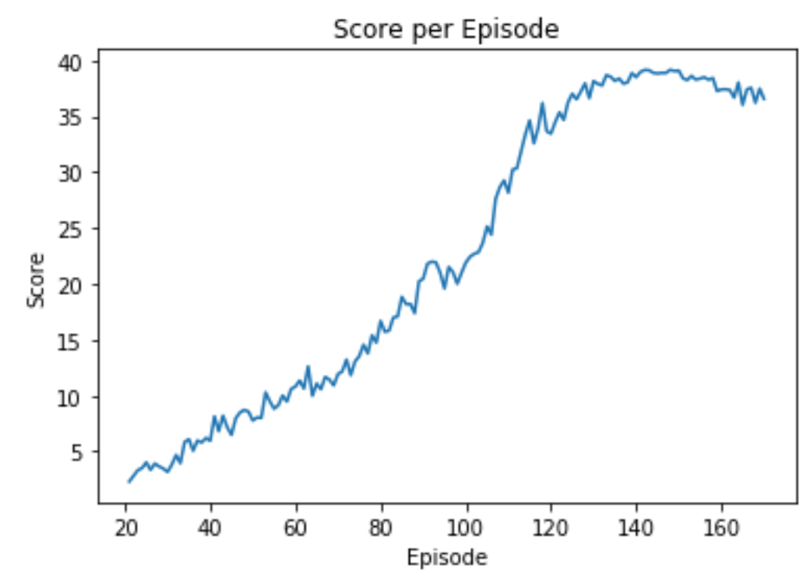

# Reacher 20 - Continous Control Report

## Initial experiments to solve the problem

For my first experiments, I started with the one agent problem with the Udacity implementation of Deep Deterministic
Policy Gradient (DDPG) and few changes  in the implementation. I then made changes in the neural networks architecture 
for both the actor and the critic with 3 fully connected layers of sizes 256-128-32. The results didn't match the 
success criteria.

I moved to the twenty agents problem with the same parameters (DDPG with 3 FC layers of 256-128-32). I saw an improvement
in the results. I added the clipping (i.e. clipping the gradient for the critic) suggested by the Udacity Module. The results
were still not matching the success criteria. Also, for all the experiments, I tried multiple learning rates for actor 
and the critic and different parameters for the Ornstein-Uhlenbeck noise process.

Next, I tried to change the training process as suggested in the Udacity class: "to update the networks 10 times after
every 20 timesteps".

Eventually, I managed to solve the problem using the details in the next section.

## Final solution for the problem

For the solution matching the sucsess criteria, I used th DDPG implementation from the Udacity class.

For the actor and the critic: 2 fully connected layers with Batch normalizarion (BatchNorm1d). For the actor, the sizes were 33 -> 400 -> 300 -> 4. 
For the critic, the sizes were: 33 -> 400 -> 300 -> 1

I used the following parameters: 

replay buffer size = int(1e6)  
minibatch size = 128        
discount factor = 0.99            
for soft update of target parameters = 1e-3              
learning rate of the actor  = 1e-3         
learning rate of the critic = 1e-3 
weight decay = 0
Ornstein-Uhlenbeck mu = 0  
Ornstein-Uhlenbeck theta = 0.15       
Ornstein-Uhlenbeck sigma = 0.2  

For training, I updated the networks 10 times after every 20 timesteps and I used an epsilon decay technique to decreash by 1e-7 at each step. 

In the jupyter notebook, you can see the training meeting the succes criteria at the end.

## Results and future work

The following plot shows the 

Due to computation limitations, I couldn't do extensive parameters hyper-tuning. As a next step, I would **optimize the** 
**current DDPG solution**: different actor and critic structures, other noises strategy and different learning rates. 
Next, I would explore other solutions as A3C, D4PG and PPO.  

